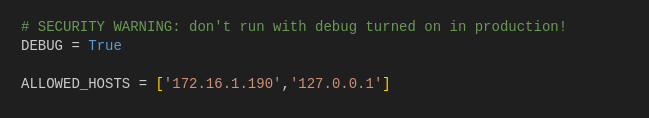
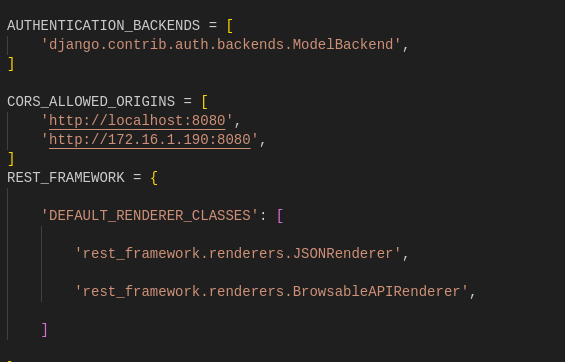

# BitBlast Project README

## Introduction
BitBlast is a project built using Django and Vue.js. It aims to provide a platform for creating and managing Database clusters.

## Prerequisites
Before you begin, make sure you have the following installed on your system:

- Python (version >= 3.x)
- Node.js (version >= 18.x)
- npm (Node Package Manager)

##  Clone the BitBlast Repository
```
git clone <repository_url>

cd dbaas-new
```

## let's break down the setup process for Django and Vue.js projects separately.

### Django Project Setup:

Step 1: Set Up a Virtual Environment 
```
python3 -m venv env

source env/bin/activate  # Activate the virtual environment
```
Step 2: Change Directory
```
cd DBaaS_project
```
Step 3: Install Django and Other Dependencies

```
pip install -r requirements.txt
```

Step 4: Configure Django Settings

Navigate to the **'settings.py'** file within your Django project directory and locate the following sections:
```
# SECURITY WARNING: don't run with debug turned on in production!

DEBUG = True

ALLOWED_HOSTS = ['172.16.1.69','127.0.0.1']
```


- Update the **'DEBUG'** setting to False when deploying to production.
- Add the IP addresses or domain names that you want to allow to access your **'Django'** application to the **'ALLOWED_HOSTS'** list.

Step 5: Configure CORS Settings

You're using CORS (Cross-Origin Resource Sharing) in your Django application, you can configure allowed origins as follows:
```
CORS_ALLOWED_ORIGINS = [  
    'http://localhost:8080',
    'http://172.16.1.69:8080',
]
```
Ensure that the origins listed here match the actual frontend URLs from which your Vue.js application will be making requests.



Step 6: Apply Migrations
```
python manage.py makemigrations

python manage.py migrate
```
Step 7: Run the Django Development Server
```
python manage.py runserver 0.0.0.0:Port
```
#### Additional Notes:

- In a production environment, make sure to set **'DEBUG'** to **'False'** to prevent exposing sensitive information and improving security.
- Update the **'ALLOWED_HOSTS'** list with the IP addresses or domain names of the servers that are allowed to access your Django application.
- Adjust the CORS settings **('CORS_ALLOWED_ORIGINS')** based on your frontend application's requirements to allow cross-origin requests.
- Always keep sensitive information such as database credentials secure, especially in production environments.

### Vue.js Project Setup:

Step 1: Install Node.js and npm (if not already installed)

Step 2: Change Directory
```
cd DBaaS_template
``` 
Step 3: Install Project Dependencies
Once you're inside your Vue.js project directory, you can run the following command to install the dependencies listed in the package.json file:
```
npm install
```
This command will read the package.json file in your project directory, fetch all the dependencies listed there, and install them in the node_modules directory within your project.

Step 4: Wait for Installation

The **'npm install'** command might take some time to complete, depending on the number of dependencies and your internet connection speed. Wait for the process to finish.

Step 4: Verify Installation

After the installation process is complete, you can verify that the dependencies were installed successfully by checking the **'node_modules'** directory in your project. You can also look for any error messages in the terminal during the installation process.

Step 5: Run the Vue.js Development Server
```
npm run serve
```

## Additional Notes:

- It's essential to run **'npm install'** whenever you clone a Vue.js project or when someone else updates the **'package.json'** file with new dependencies.
- If you're working in a team, make sure to commit the **'package.json'** and **'package-lock.json'** files to version control to ensure consistency across different environments.
- Avoid modifying the **'node_modules'** directory manually as it's generated and managed by npm. Any changes made here might get overwritten or cause conflicts during future installations.
- You can also use **'npm ci'** instead of **'npm install'** in certain scenarios, especially for continuous integration setups, to ensure a clean and reproducible installation of dependencies based on **'package-lock.json'**.interact with your integrated application.
